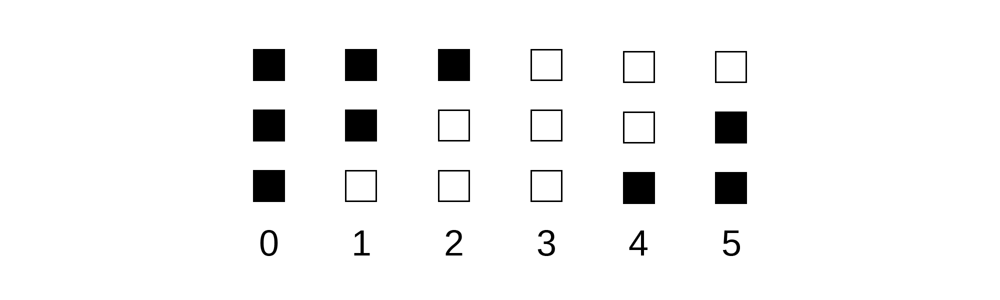

# What is FILO Clock?
FILO Clock is an open-source digital clock similar to binary clocks or the TIX
clock that display the time using discrete LEDs. It shows time using a FILO
(First-In Last-Out) system described (below)[#how-to-read-the-filo-system]

# Pictures


# About Us
We are Connor Northway and Eddie Zhou, currently two second-year Computer
Engineering and Computer Science students at Northeastern University (as of
writing this post).

# Inspiration
The idea itself came from this [Smarter Every Day video](https://youtu.be/VvVigAr4hZc?t=661), in which Destin shows off his [TIX clock](https://www.thinkgeek.com/product/7437/).
Unfortunately the original version of this clock is no longer made, but check out the [TIX Clock II](https://www.tixclock.shop/) if you want to buy one.

# How to Read the FILO System
White = ON  
Black = OFF

Each column shows a different number that the indicator can display.
With the 5 LEDs above, the numbers 0-9 can be displayed.


The numbers 0-5 shown with 3 LEDs.

# Device Specifications
## Hardware

* Microcontroller - ATTiny84
* Real Time Clock (RTC) - DS1307
* Individually Addressable RGBW LEDs - 14x SK6812
* USB Type-C
* CR3032 Battery Backup for RTC
* Joystick for on-clock settings

## Software

* Arduino-compatible firmware
* USB 1.1 via Micronucleus
* On-clock configurable colors and animations

# Build Guide
## Tools

### Essentials

* Soldering Iron
* Solder
* Flux
* Tweezers
* Desoldering Wick
* Multimeter
* Magnifying glass or microscope

## Components

PCB:
[Gerber Files](https://github.com/filoclock/hardware/tree/master/gerbers)

For a detailed list of components with part numbers and ordering links see:
[Bill of Materials](https://docs.google.com/spreadsheets/d/1V83YUcRUipDrwoqBEJTFpV8GhJwbHhm9ufcjOwlMkEM/edit?usp=sharing)

Solderable Components:

* 14x RGBW SK6812
* ATTiny84A
* DS1307Z
* 5-Way Switch
* Type-C Connector
* Reset Switch
* 2x 5V Varistors
* 32.768 kHz Crystal
* 22 uF Capacitor
* 500 ma PTC Fuse
* 16x 100 nF Capacitor
* CR2032 Holder
* 2x 3.6 V Zener Diodes
* 4x 5.1 kOhm Resistors
* 2x 68 Ohm Resistors
* 1.5 kOhm Resistor

Other Components:

* USB-C Cable
* CR2032 Battery
* 2x M3x20 Standoffs
* 2x M3 Screws

Quantity is for each board, and is 1x unless specified.

## Soldering

### Step 1

Solder the SK6812 LEDs to the front. They are oriented so that the warm white
portion points toward the top of the clock (the corner notch will be in the
top left)

This is done first because it is easy to solder the LEDs with no components on
the back. Once the LEDs are in place, they provide an even base to hold the 
board level when flipped over.

### Step 2

Next, solder the high pin count SMD components to the back. This includes the 
USB-C connector, ATTINY, and DS1307. This way, other components won't be in 
the way of these more difficult components.

```
editors notes

point to a SMD soldering tutorial
suggested tools

reference components by name once BOM is included
WARN about switch! its internal plastic structure is easily melted when
attempting to fix soldering mistakes, which will lead to a stuck switch!
```

## Firmware Installation

set up arduino as ISP programmer

install libusb-dev (on ubuntu)

make the micronucleus commandline tool

make the micronucleus firmware for filo

install avrdude

flash the bootloader!
`avrdude -c arduino -p t84 -P <programmer serial port> -b 19200 -U flash:w:<path to filo bootloader>`

where <programmer serial port> is the serial port of the programmer (`/dev/ttyACM0` in my case)

and <path to filo bootloader> is the path to the hex file you made above
