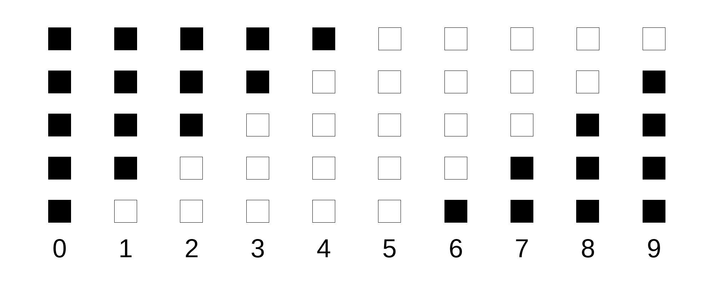
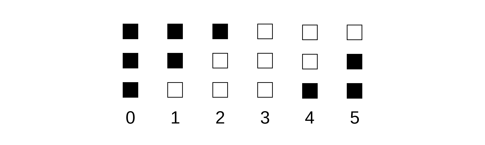

# What is FIFO Clock?
FIFO Clock is an open-source digital clock similar to binary clocks or the TIX
clock that display the time using discrete LEDs. It shows time using a FIFO
(First-In First-Out) system described [below](#how-to-read-the-filo-system).

# Pictures

# About Us
We are Connor Northway and Eddie Zhou, currently two second-year Computer
Engineering and Computer Science students at Northeastern University (as of
writing this post).

# Inspiration
The idea itself came from this [Smarter Every Day video](https://youtu.be/VvVigAr4hZc?t=661), in which Destin shows off his [TIX clock](https://www.thinkgeek.com/product/7437/).
Unfortunately the original version of this clock is no longer made, but check out the [TIX Clock II](https://www.tixclock.shop/) if you want to buy one.

# How to Read the FIFO System
White = ON  
Black = OFF

Each column shows a different number that the indicator can display.
With the 5 LEDs above, the numbers 0-9 can be displayed.

The numbers 0-5 shown with 3 LEDs.

# Device Specifications
## Hardware

* Microcontroller - ATTiny84
* Real Time Clock (RTC) - DS1307
* Individually Addressable RGBW LEDs - 14x SK6812
* USB Type-C
* CR3032 Battery Backup for RTC
* Joystick for on-clock settings

## Software

* Arduino-compatible firmware
* USB 1.1 via Micronucleus

# Build Guide
## Tools

* Soldering Iron (with temperature control)
* Solder
* Flux
* Tweezers
* Desoldering Wick
* Multimeter
* Magnifying glass or microscope

## What you'll need

PCB:
[Gerber Files](https://github.com/filoclock/hardware/tree/master/gerbers)

You can download these and send them to a number of PCB manufacturers
(JLCPCB, PCBWay, etc)

For a detailed list of components with part numbers and ordering links see:
[Bill of Materials](https://docs.google.com/spreadsheets/d/1V83YUcRUipDrwoqBEJTFpV8GhJwbHhm9ufcjOwlMkEM/edit?usp=sharing)

We purchased most of our components from LCSC, and the LEDs from AliExpress.

Other hardware you'll need to complete the clock:

* USB-C Cable
* CR2032 Battery
* 2x M3 Screws (about 40mm length)
* 2x M3 Nuts

The M3 hardware can be replaced by 6/32 imperial hardware.

## Soldering

This project involves quite a few small SMD components. If you don't have
much experience with SMD soldering, check out the EEVBlog's excellent
[video](https://www.youtube.com/watch?v=b9FC9fAlfQE) on the subject.

Components are listed on the BOM with their reference designator, which
can be matched to the silkscreened text on the PCB.

### Step 1 - LEDs

Solder the SK6812 LEDs to the front. They are oriented so that the warm white
portion points toward the top of the clock (the corner notch will be in the
top left). Past v1.1 there should be a silk-screened corner to align them.

The LEDs are somewhat thermally sensitive, so try not to heat them for too long
or you may end up with strange issues later.

### Step 2 - SMD

Solder the high pin count SMD components to the back. This includes the
USB-C connector, ATTINY, and DS1307. This way, other components won't be in
the way of these more difficult components.

Next, do small passives (resistors and capacitors).

Lastly, solder the reset button and joystick.

WARNING: The joystick's  internal plastic structure is easily melted when
attempting to fix soldering mistakes, which will lead to a stuck switch!
Be careful and do not apply heat for long periods of time.

### Step 3 - Through-Hole

Finally, solder the through-hole components, including the battery holder,
RTC crystal, and programming header.

## Firmware Installation

(Note: These instructions are for Linux-based systems, and may need some
modification to work on Windows/MacOS)

### Setting up Tools

To flash the initial micronucleus bootloader, you will need an in-circuit
serial programmer (ISP). The easiest option is to set up an arduino board to
act as one. Instructions for doing so can be found
[here](https://www.arduino.cc/en/tutorial/arduinoISP).

Next, you'll want to install `avrdude` (which should be in your distribution's
repositories) and micronucleus, which can be cloned from its github repo
[here](https://github.com/micronucleus/micronucleus). You'll need to run
`make; sudo make install` to make and install the commandline tool. `avrdude`
will be used to install the bootloader, and `micronucleus` will be used to
program the clock through USB.

Now that all the necessary tools are installed, clone the
[firmware repo](https://github.com/fifoclock/firmware).

Note: this next step is only needed if you want to customize the bootloader.
Otherwise, you can just use the boot.hex provided in our firmware repo.

### Building the Bootloader

Copy the `fifo-default` folder into the `firmware/configuration`
folder of the micronucleus repository you cloned earlier. Then run
`make clean; make CONFIG=fifo-default` to create the .hex file.

### Flashing the Bootloader

Once you have the bootloader .hex made and the ISP connected, run the following
command to flash the bootloader:

`avrdude -c arduino -p t84 -P \<programmer serial port\> -b 19200 -U flash:w:\<path to filo bootloader\>`

where `<programmer serial port>` is the serial port of the programmer
(`/dev/ttyACM0` in my case) and `<path to filo bootloader>` is the path to the
 bootloader .hex file.

### Setting up the Arduino IDE

Install the Arduino IDE if you haven't already.

Open the preferences window, and click the button next to "Additional Boards
Manager URLs". Paste the following URL in and accept the changes
`https://raw.githubusercontent.com/fifoclock/board-definitions/master/package_fifoclock_index.json`.

Lastly, find the .arduino folder

### Writing Firmware

